# D2C: Diffusion-Decoding Models for Few-shot Conditional Generation

[**Project**](https://d2c-model.github.io/) | [**Paper**](https://arxiv.org/abs/2106.06819)

[](https://colab.research.google.com/drive/1BLJCQv1NrwFupnWw54lKb337tdtM5dn8?usp=sharing)


PyTorch implementation of **D2C: Diffuison-Decoding Models for Few-shot Conditional Generation**.

[Abhishek Sinha*](https://a7b23.github.io/), [Jiaming Song*](https://tsong.me/), [Chenlin Meng](https://cs.stanford.edu/~chenlin/), [Stefano Ermon](https://cs.stanford.edu/~ermon/)

Stanford University

## Overview

Conditional generative models of high-dimensional images have many applications, but supervision signals from conditions to images can be expensive to acquire. This paper describes Diffusion-Decoding models with Contrastive representations (D2C), a paradigm for training unconditional variational autoencoders (VAEs) for few-shot conditional image generation. By learning from as few as 100 labeled examples, D2C can be used to generate images with a certain label or manipulate an existing image to contain a certain label. Compared with state-of-the-art StyleGAN2 methods, D2C is able to manipulate certain attributes efficiently while keeping the other details intact.

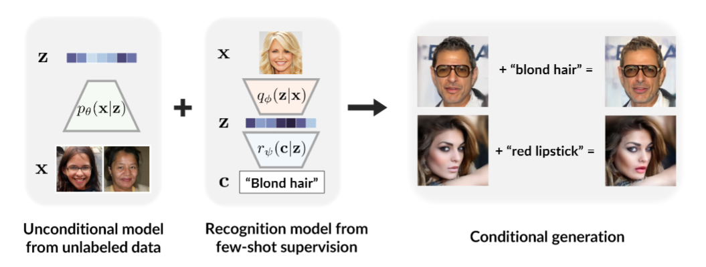

Here are some example for image manipulation. You can see more results [here](https://d2c-model.github.io/).

<table>
<thead>
<tr>
  <th onclick="sorting(tbody, 0)">Attribute</th>
  <th onclick="sorting(tbody, 1)" width="17%">Original</th>
  <th onclick="sorting(tbody, 2)" width="17%">D2C</th>
  <th onclick="sorting(tbody, 3)" width="17%">StyleGAN2</th>
  <th onclick="sorting(tbody, 4)" width="17%">NVAE</th>
  <th onclick="sorting(tbody, 5)" width="17%">DDIM</th>
</tr>

</thead>
<tbody>
  <tr>
  <td>Blond</td>
 <td></td>
 <td></td>
 <td>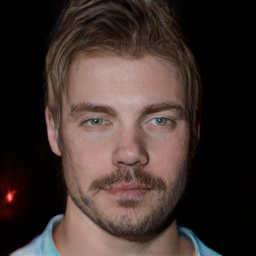</td>
 <td>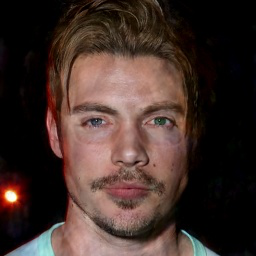</td>
 <td>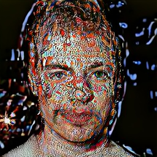</td>
</tr>
  <tr>
  <td>Red Lipstick</td>
 <td>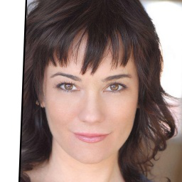</td>
 <td>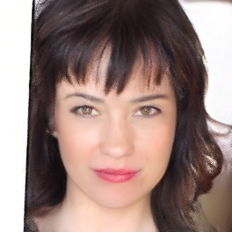</td>
 <td>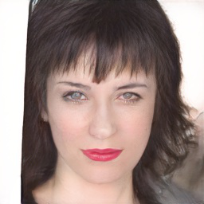</td>
 <td>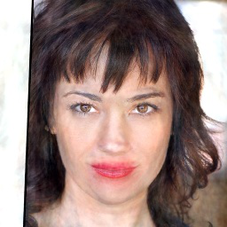</td>
 <td>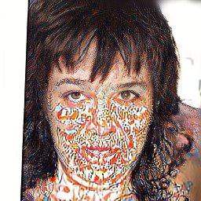</td>
</tr>
<tr>
<td>Beard</td>
 <td></td>
 <td>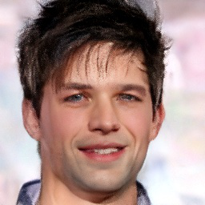</td>
 <td>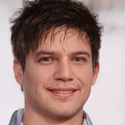</td>
 <td>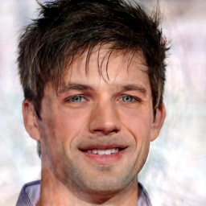</td>
 <td></td>
</tr>
</tr>
</tbody>
</table>

## Getting started
The code has been tested on PyTorch 1.9.1 (CUDA 10.2).

To use the checkpoints, download the checkpoints from [this link](https://drive.google.com/drive/folders/1rbztSCF27azt64M2d3dsL38ZDZ489Rsn?usp=sharing), under the `checkpoints/` directory.
```[bash]
# Requires gdown >= 4.2.0, install with pip
gdown https://drive.google.com/drive/u/1/folders/1DvApt-uO3uMRhFM3eIqPJH-HkiEZC1Ru -O ./ --folder
```

## Examples 
The `main.py` file provides some basic scripts to perform inference on the checkpoints. 

We will release training code soon on a separate repo, as the GPU memory becomes a bottleneck if we train the model jointly.

Example to perform image manipulation:

- Red lipstick
```
python main.py ffhq_256 manipulation --d2c_path checkpoints/ffhq_256/model.ckpt --boundary_path checkpoints/ffhq_256/red_lipstick.ckpt --step 10 --image_dir images/red_lipstick --save_location results/red_lipstick
```

- Beard
```
python main.py ffhq_256 manipulation --d2c_path checkpoints/ffhq_256/model.ckpt --boundary_path checkpoints/ffhq_256/beard.ckpt --step 20 --image_dir images/beard --save_location results/beard
```

- Blond
```
python main.py ffhq_256 manipulation --d2c_path checkpoints/ffhq_256/model.ckpt --boundary_path checkpoints/ffhq_256/blond.ckpt --step -15 --image_dir images/blond --save_location results/blond
```


Example to perform unconditional image generation:
```
python main.py ffhq_256 sample_uncond --d2c_path checkpoints/ffhq_256/model.ckpt --skip 100 --save_location results/uncond_samples
```

## Extensions

We implement a `D2C` class [here](https://github.com/jiamings/d2c_pre_release/blob/main/d2c/__init__.py) that contains an autoencoder and a diffusion latent model. See code structure here.

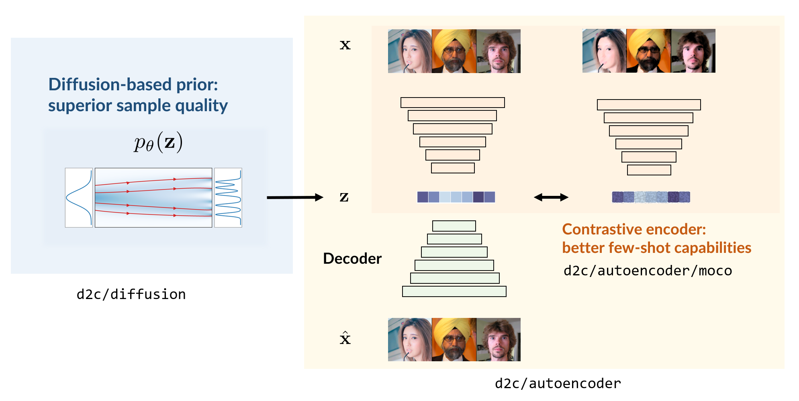

Useful functions include: `image_to_latent`, `latent_to_image`, `sample_latent`, `manipulate_latent`, `postprocess_latent`, which are also called in `main.py`.


## Todo

- [ ] Release checkpoints and models for other datasets.
- [ ] Release code for conditional generation.
- [ ] Release training code and procedure to convert into inference model.
- [ ] Train on higher resolution images.


## References and Acknowledgements

If you find this repository useful for your research, please cite our work.
```
@inproceedings{sinha2021d2c,
  title={D2C: Diffusion-Denoising Models for Few-shot Conditional Generation},
  author={Sinha*, Abhishek and Song*, Jiaming and Meng, Chenlin and Ermon, Stefano},
  year={2021},
  month={December},
  abbr={NeurIPS 2021},
  url={https://arxiv.org/abs/2106.06819},
  booktitle={Neural Information Processing Systems},
  html={https://d2c-model.github.io}
}
```

This implementation is based on:
- [DDIM](https://github.com/ermongroup/ddim).
- [NVAE](https://github.com/nvlabs/nvae).
- [IDinvert](https://github.com/genforce/idinvert_pytorch)
